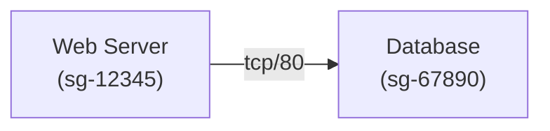

# sgmap - AWS Security Group Mapping Tool

`sgmap`は、AWS のセキュリティグループの接続関係を可視化するための CLI ツールです。指定した VPC 内のセキュリティグループ間の接続関係を mermaid 記法のフローチャートまたは JSON 形式で出力します。

## 機能

- 指定した VPC 内のすべてのセキュリティグループの接続関係を分析
- 特定のセキュリティグループのみを分析するオプション
- mermaid 記法のフローチャートまたは JSON 形式での出力
- セキュリティグループ間の接続プロトコルとポート情報の表示

## インストール

### pip を使用したインストール

```bash
pip install sgmap
```

### ソースからのインストール

```bash
git clone https://github.com/youyo/sgmap.git
cd sgmap
pip install -e .
```

## 使用方法

### 基本的な使用方法

```bash
# VPC内のすべてのセキュリティグループを分析し、mermaid記法で出力
sgmap --vpc-id vpc-12345678

# 特定のセキュリティグループのみを分析
sgmap --vpc-id vpc-12345678 --security-group-id sg-87654321

# JSON形式で出力
sgmap --vpc-id vpc-12345678 --json
```

### オプション

- `--vpc-id`, `-v` (必須): 分析対象の VPC ID
- `--security-group-id`, `-s` (オプション): 特定のセキュリティグループ ID を指定して分析
- `--json`, `-j` (フラグ): JSON 形式で出力（デフォルトは mermaid 記法）

## 出力例

### mermaid 記法の出力例



### JSON 形式の出力例

```json
{
  "sg-12345": {
    "name": "Web Server",
    "inbound": [],
    "outbound": [
      {
        "id": "sg-67890",
        "name": "Database",
        "protocol": "tcp",
        "from_port": 80,
        "to_port": 80
      }
    ]
  },
  "sg-67890": {
    "name": "Database",
    "inbound": [
      {
        "id": "sg-12345",
        "name": "Web Server",
        "protocol": "tcp",
        "from_port": 80,
        "to_port": 80
      }
    ],
    "outbound": []
  }
}
```

## 必要条件

- Python 3.6 以上
- boto3
- click
- AWS 認証情報（環境変数、~/.aws/credentials など）

## ライセンス

MIT

## 作者

youyo
